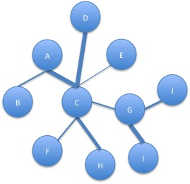

# Graphs

## About

This project is just a piece of code I was lazily accumulating over a few months (nothing special). So lazily that I have not even come up with a better name for it.

## Author

Created by Kirill Rodriguez on 04/2016.

## Ambitions

I am ambitious:

* Learn how to do graphs
* Efficient implementation of different types of graphs (simple/directed, labelled/colored, etc)
* Search algorithms (bidir. bfs, dfs, dijkstra, etc)
* Connectivity
* Trees, DAGs (topological sort, prufer coding, etc)
* Unicyclic graphs (enumeration)
* Isomorphism of different types of graphs
* Different matrices (adjacency, incidence, Laplace)
* Minimal spanning tree
* Graph coloring
* Planarity and visualization
* more...

Barely any of it is implemented and tested in the same time.

## Purpose

The purpose is to design a solid graph library and to practice implementing graph algorithms with it.

## Usage

### Compiling

To compile, go to the project folder and run

	./compile

Asserting this works.

### Testing

	./bin/_tgraph

### Using

To use it, simply link the compiled graph static library within your project. The library is tested with **googletest**s and should work somehow.

## Note

This library is a part of [xNERD Space Program](https://github.com/theoden8/xNERD/projects/1).
